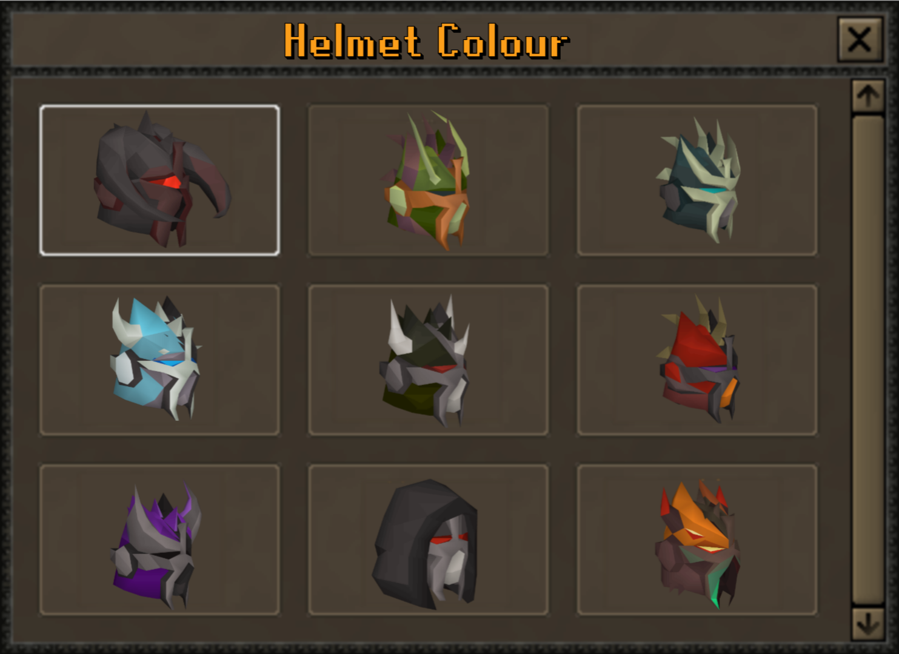

# Completionist cape and hooded Slayer helmets

Design brief from the owner's request on **2026-10-07**. Current status: [PROGRESS.md](../../PROGRESS.md).

## Completionist cape

Create a custom OSRS-style cape with particles as the reward for **100% completion** of the defined permanent main-world requirements.

### Unlock requirements

All requirements must be satisfied together:

| Area | Required completion |
|---|---|
| Skills | Base level 99 in every required skill. |
| Experience | **200,000,000 XP in every required skill.** This is the working interpretation of the request; reaching this also covers level 99. |
| Achievements | Every required achievement, including the applicable diary and Combat Achievement categories. |
| Collection Log | Every required unique entry obtained, including pets. Duplicate obtains and item value do not affect completion. |

- Define one explicit, versioned requirement set. Show missing requirements in-game with current/required values and a link to the relevant category.
- Required content must be playable and its rewards obtainable. Missing implementations, placeholder tasks and cache-only items cannot pass a requirement or silently reduce the target.
- Keep the permanent main-world profile separate from seasonal Leagues. Review unavailable/retired entries explicitly when defining the required set.
- Exclude the completionist reward itself from its unlock requirements to prevent a circular Collection Log dependency. Count each required item once even if multiple log categories contain it.
- Read native XP, achievement and Collection Log records through one eligibility service. Recheck when claiming and equipping; use committed gameplay events for updates instead of scanning every player each tick.
- Decide the requalification policy for newly released requirements before launch. Preserve earned items and existing progress when requirements change.

### Appearance and particles

- Give the cape its own silhouette, emblem, colours and particle effect while retaining the server's OSRS visual style. Final stats and perks remain a design decision.
- Verify inventory and worn models, both player body types, cape movement, clipping and item mappings on the accepted **revision-240** server/cache/Nero pair.
- Confirm cape-bound particle support in the paired client first. Server code alone does not establish working particles. Check the native renderer and existing 117 HD setup.
- Render effects client-side from equipment state, with bounded emitters, distance culling and a viewer setting to reduce/disable particles. Avoid particle entities or per-particle server packets.
- Validate a crowded scene with effects on/off and cleanup on unequip, logout and scene changes. Disabling visuals must not alter eligibility or item bonuses.

### Optional completionist monkey

The monkey remains an **undecided cosmetic alternative**, not an additional committed feature. The cape is the primary direction because the owner wants a distinct identity.

If selected, use an original back-slot design and the same completion requirements. A separate follower/pet system is outside this proposal.

Reference: [Alora's completionist cape/monkey guide](https://www.alora.io/forums/topic/81703-completionist-cape-completionist-monkey-information/), reviewed 2026-10-07. It demonstrates milestone rewards and appearance variants; its thresholds, combined cape bonuses, prices and donor variants are not adopted by this brief.

## Hooded Slayer helmets

Add a hooded Slayer helmet and cosmetic variants based on the owner's visual reference. The **bottom-centre helmet** shows the requested black hood around the visible mask. The other tiles provide colour and ornament directions; their exact item names and model IDs are unconfirmed.

Helmet visual reference

- Preserve the recognisable Slayer mask inside the hood. Reference palettes include black/red, green/orange, teal/ivory, light blue/white, olive/silver, red/gold, purple/silver and orange/green.
- Define the final supported variant list and unlock method before implementation. Provide previews and controlled switching for unlocked styles through existing native-style menus.
- Treat the variants as cosmetic by default. Preserve the corresponding helmet's stats, Slayer-task effects, protection parameters and normal/imbued state.
- Model, recolour and variant mappings must be explicit. Switching styles cannot grant a free imbue, remove an existing imbue or duplicate the item.
- Use atomic inventory changes for conversion/reversion. Validate equipped appearance, head/hair clipping, animations, save/relog and the existing death/reclaim rules for both body types.

## Implementation starting points

- [Max cape](../../content/other/max-cape) supplies existing equipment/menu patterns. Its [documented perks](../max-cape.md) are not a complete automatic perk bundle for the new cape.
- [PlayerStatMap](../../engine/game/src/main/kotlin/org/rsmod/game/stat/PlayerStatMap.kt) already caps each skill at 200m XP; [CharacterStatPipeline](../../api/account/src/main/kotlin/org/rsmod/api/account/character/stats/CharacterStatPipeline.kt) owns native persistence. Respect fine-XP units; use wide totals when aggregating skills.
- [Collection Log](../../content/interfaces/collection-log) owns obtains and category tracking. Expose a narrow read-only query if needed; its internal helpers are not automatically accessible from another module. Reuse the planned achievement framework.
- [Combat attribute collectors](../../api/combat/combat-formulas/src/main/kotlin/org/rsmod/api/combat/formulas/attributes/collector) read Slayer/imbued parameters; the new helmet variants must participate in those active paths. Check the [existing crafting recipes](../../content/skills/crafting/pack/src/main/kotlin/org/rsmod/content/skills/crafting/pack/Crafting.kt) before adding another conversion route.

First verify assets and a small visual prototype, then implement the requirements and reward flow. Apply [AGENTS.md](../../AGENTS.md), including the upstream/PR comparison, when either roadmap item is selected for development.
